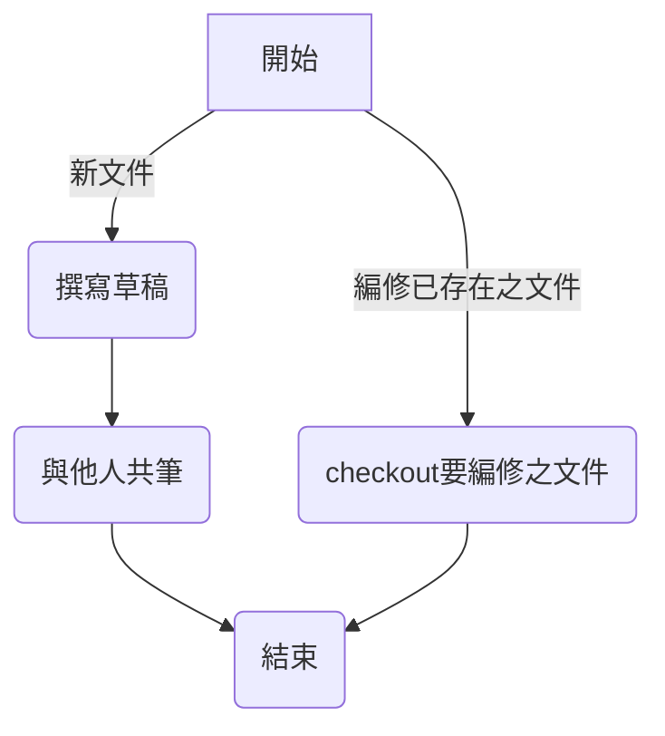

- [ ] A
- [ ] B
- [ ] C
- [x] A
- [x] B
- [x] C

| 靠左對齊 | 置中對齊 | 靠右對齊 |
|-----------|:-----------:|--------------------------------:|
| Cell A1 | Cell A2 | Cell A3 |
| Cell B1 | Cell B2 | Cell B3<br/>second line of text |

\


| 1 | 1 | 2 |
| - | - | - |
| 1 | 1 | 2 |
| 2 | 1 | 2 |
| 2 | 1 | 2 |

| Heading 1 | Heading 2 | Heading 3 |
|-----------|-----------|---------------------------------|


# H1

This is a [book](url)
---

    AAAAA
BBBBB

>這段與法就是這要\
>123123123

I工作坊\
123

## H2

* Item\
  IIII
  DDDD
  
- Item

### H3

1. 
  - sub1
  - sub2

2. 23
3. `xx`
4. **xx**

   >testtesttest


4. 34


6. 


<details>
    <summary>點擊我可開啟完整內容</summary>

    

</details>


#### H4

**TEXT**\
*TEXT*\
~~TEXT~~

##### H5

```bat
@echo asad

```

###### H6
